# LogiStock
Full-stack E-commerce app built with Spring Boot, Angular, Spring Security 6, JWT, and AWS deployment.  

---

## Project Overview
This is a full-stack e-commerce application with the following features:  
- **Backend:** Spring Boot, Spring Data JPA, Spring Security 6, JWT authentication, REST APIs  
- **Frontend:** Angular, Bootstrap 5  
- **Deployment:** AWS (S3, EC2, RDS, CloudFront)  
- **Database:** H2  
- **Security:** JWT authentication, role-based access control  
-  **CI/CD:** GitHub Actions, Docker, Kubernetes  

---

##  Project Structure  
```
logistock/
│── e-commerce-backend/                 
│   ├── src/main/java/...      
│   ├── src/main/resources/    
│   ├── pom.xml                
│── e-commerce-frontend/       
│   ├── src/                   
│   ├── public/                
│   ├── package.json           
│── README.md                  
│── .gitignore                 
│── docker-compose.yml         
```

---

## Installation & Setup

### 1 Clone the Repository 
```sh
git clone https://github.com/TermoTheBavarian/LogiStock.git
cd logistock
```

### 2 Backend Setup 
- Navigate to Backend Folder:  
  ```sh
  cd logistock-backend
  ```
- Configure Database: Update `application.properties` or `application.yml`  
- Run the Application:  
  ```sh
  mvn spring-boot:run
  ```

### 3 Frontend Setup
- Navigate to Frontend Folder:
  ```sh
  cd logistock-frontend
  ```
- Install Dependencies:
  ```sh
  npm install
  ```
- Start Development Server: 
  ```sh
  ng serve
  ```

---

## API Endpoints 
| Method | Endpoint                     | Description                   |
| ------ | ---------------------------- | ----------------------------- |
| POST   | `/api/auth/signup`           | User registration             |
| POST   | `/api/auth/login`            | User login                    |
| POST   | `/api/products`              | Create a product              |
| GET    | `/api/products`              | Get all products              |
| GET    | `/api/products/{id}`         | Get product by ID             |
| PUT    | `/api/products/{id}`         | Update product by ID          |
| DELETE | `/api/products/{id}`         | Delete product by ID          |
| POST   | `/api/cart`                  | Add product to cart           |
| GET    | `/api/cart`                  | Get cart items                |
| DELETE | `/api/cart/{productId}`      | Remove product from cart      |
| POST   | `/api/orders`                | Place an order                |
| GET    | `/api/orders`                | Get all orders for user       |
| GET    | `/api/orders/{orderId}`      | Get order details             |
| PUT    | `/api/orders/{orderId}/pay`  | Mark order as paid            |
| PUT    | `/api/orders/{orderId}/ship` | Mark order as shipped (admin) |
| GET    | `/api/users`                 | Get all users (admin)         |
| GET    | `/api/users/{userId}`        | Get user details (admin)      |
| PUT    | `/api/users/{userId}`        | Update user (admin)           |
| DELETE | `/api/users/{userId}`        | Delete user (admin)           |

---

## Stack
### Backend:  
- Spring Boot  
- Spring Data JPA  
- Spring Security 6 & JWT  
- H2  
- Hibernate  
- Maven  

### Frontend: 
- Angular    
- Bootstrap 5

### Cloud & DevOps: 
- AWS S3, EC2, RDS, CloudFront  
- Docker & Kubernetes  
- CI/CD with GitHub Actions  

---

## Future Enhancements  
- ✅ Payment Gateway Integration (Razorpay/Stripe)  
- ✅ Admin Dashboard  
- ✅ Product Recommendations with AI  

---

## Screenshots
### Login 
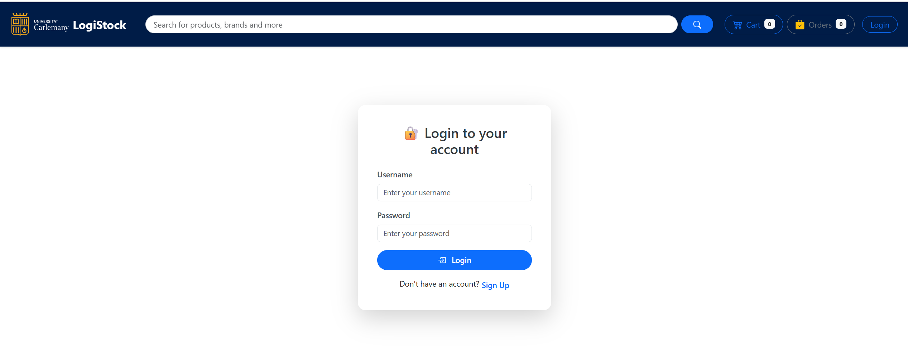 
### Cart
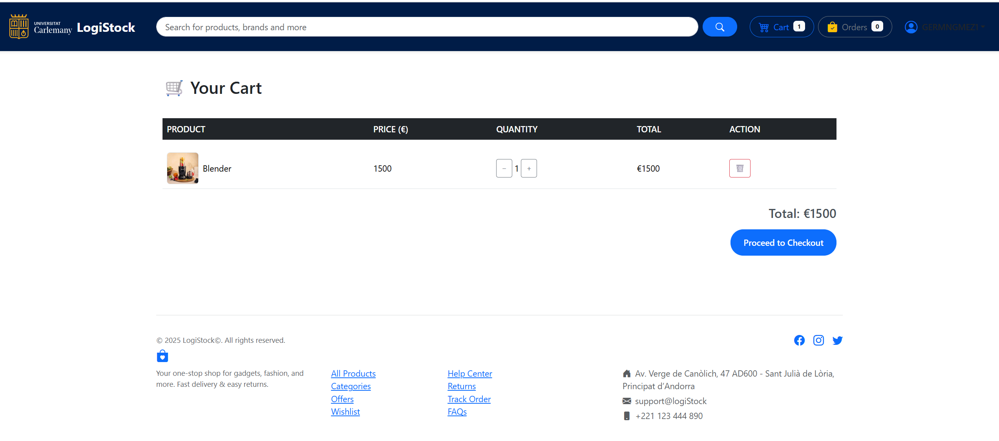 
### Checkout
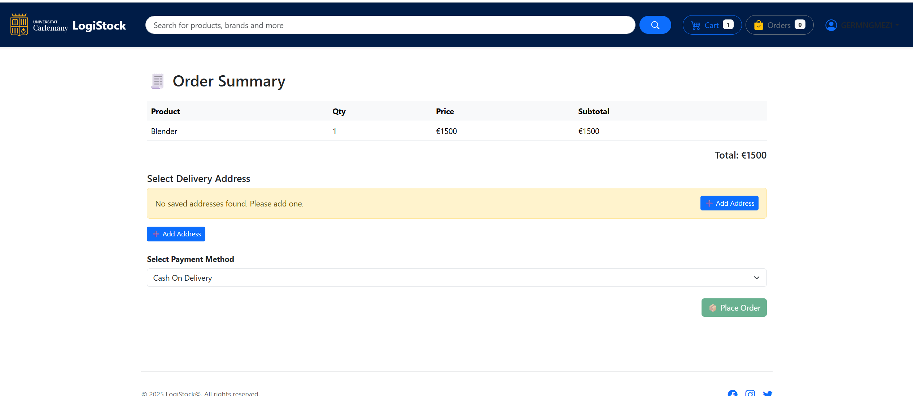 
### My Orders
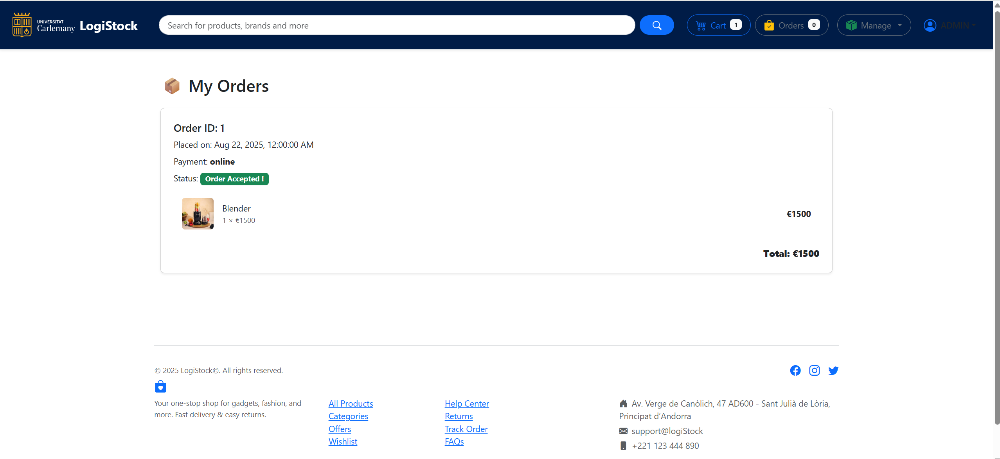 
### Create and Manage Products (ADMIN)
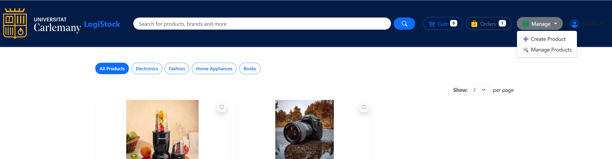 
### Create Product (ADMIN)
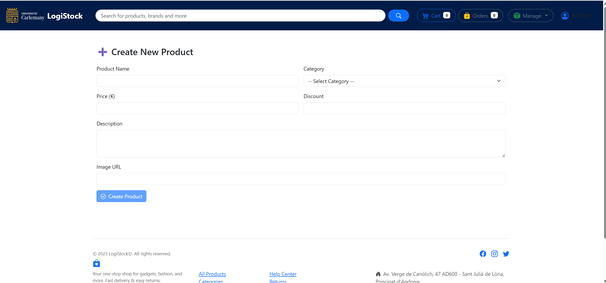 
### Manage Product (ADMIN)
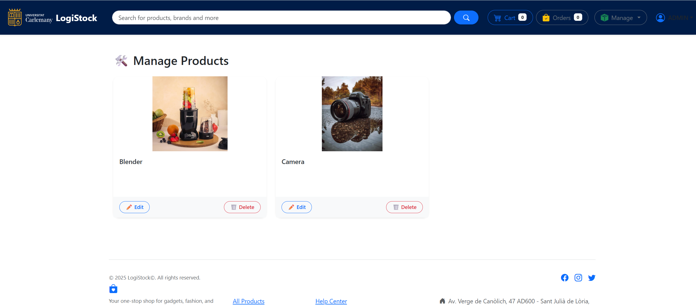 
### Signup
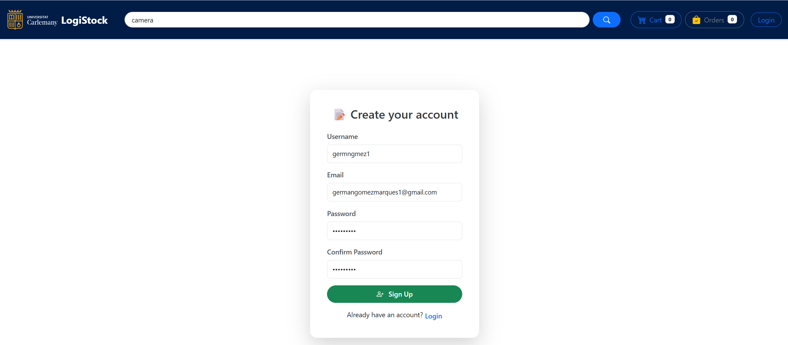 
### User Profile
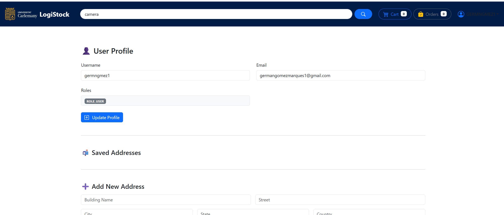 
### Wishlist
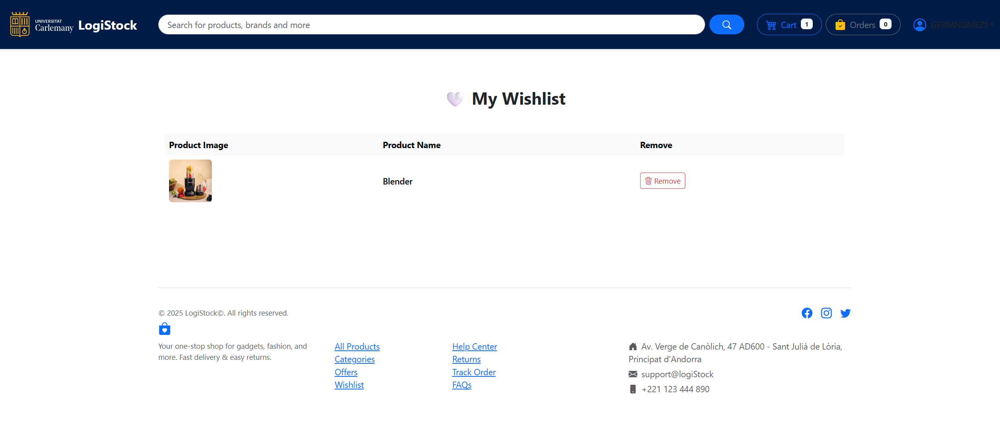 
### User Options
 
### Search
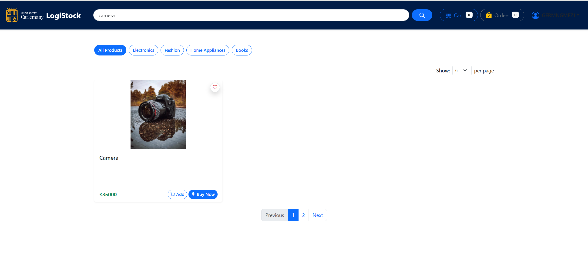
---

## License
This project is licensed under the MIT License.  
